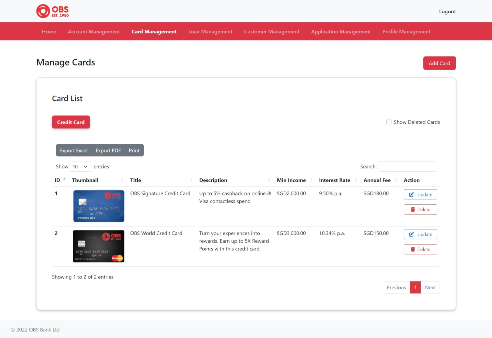

# Online Banking Service - Web Application
<!-- ALL-CONTRIBUTORS-BADGE:START - Do not remove or modify this section -->

<!-- ALL-CONTRIBUTORS-BADGE:END -->

## Overview

This project entitled “Online Banking Service” is a web-based banking application for the bank user to apply for the banking services and conduct financial transactions via the Internet. There are a total of 3 services in this project: Account Service, Credit Card Service and Loan Service.

This site allows the admin (bank managers) to add new account, credit card and loan services launched by the bank so that the user can apply for these services. Besides, the admin can review and approve the user’s application for the banking services. Once the user’s application is approved, the user can register and log into the customer portal to perform financial transactions such as fund transfers and payments. Moreover, the admin can also manage the customer bank services such as deposits or withdraws money from the customers’ accounts, add new payments for the customers’ credit cards and loans as well as activate or deactivate the bank services.

## Features
The features can be divided by 3 modules, which are the user, admin and customer modules.

### User Module
1.	About Us  
    The user can view the bank’s story, services provided and the licenses and accreditations of the bank.

2.	Bank Services Application  
    The user can apply for bank services such as accounts, credit cards, loans. To apply the bank services, the user is required to fill out the form on the website.

3.	Track Application  
    The user can track their application status once they successfully applied for the bank services.

4.	Currency Converter Tool  
    The user can check the latest foreign exchange rates and compare the exchange rates between two countries.

5.	Contact Us  
    The user can locate the bank’s headquarters and submit their feedback to the bank.

6.	Login   
    The user can login as admin or customer depending on the credentials they have entered.

7.	Register  
    The customer who is accessing the bank’s customer portal for the first time are required to register.

8.	Forgot Password  
    The customer who has forgotten their password can change their password by filling out the forgot password form.

### Admin Module

1.	Account Management  
    The admin can manage the account services of the bank. The admin can view, add, update and delete the account services. In addition, the users can view the accounts added by the admin so that they can proceed for account service application.

2.	Credit Card Management  
    The admin can manage the credit card services of the bank. The admin can view, add, update and delete the credit card services. In addition, the users can view the credit cards added by the admin so that they can proceed for credit card service application.

3.	Loan Management  
    The admin can manage the loan services of the bank. The admin can view, add, update and delete the loan services. In addition, the users can view the loans added by the admin so that they can proceed for loan service application.

4.	Application Management  
    The admin can manage the bank service applications submitted by the users. The admin can view the application forms which include the details of the user and the services they have applied for. Besides, the admin can approve, reject or require further action on the bank service application submitted by the users.

5.	Customer Management  
    The admin can manage the customers who have approved bank services. The admin can activate or deactivate the customer or their services. Besides, the admin can view all the transactions and payment history of the customer. The admin can also perform some actions on the customers’ accounts, credit cards, or loans, such as depositing or withdrawing money from a customer’s account, and adding payments on a credit card or loan.

6.	Profile Management  
    The admin can update their profile such as their name, email address, contact number and gender. Besides, the admin can also change their password.

### Customer Module

1.	Account  
    The customer can view all their accounts under the bank. Besides, the customer can also view the summary and the transaction history of the particular account.

2.	Credit Card  
    The customer can view all their credit cards under the bank. Besides, the customer can also view the summary and the transaction history of the particular credit card.

3.	Loan  
    The customer can view all their loans under the bank. Besides, the customer can also view the summary and the payment history of the particular loan.

4.	Fund Transfer  
    The customer can perform fund transfer. There are two options for the fund transfer, the customer can either choose to transfer to own account or transfer to other accounts under the same bank.

5.	Payment  
    The customer can view all the payment statements for their credit cards and loans. Besides, the customer can pay for their credit cards and loans with their accounts under the same bank.

6.	Profile Management  
    The customer can update their profile such as their name, email address, contact number and gender. Besides, the customer can also change their password.

## Tech Stack

-	Java 8
-	Spring Framework 5.1.1
-	Hibernate 5.3.1
-	JSP
-	JavaScript
-	CSS
-	Bootstrap 5
-	MySQL 8.0.30
-	Apache Tiles 3.0.5
-	Apache Tomcat 9.0

## System Design

### System Architecture

 

### Database Schema Design

 

## Preview

### User Module

1. Home Page     
2. About Us     
3. Contact Us     
4. Account Service     
5. Account Application     
6. Credit Card Service     
7. Credit Card Application     
8. Loan Service     
9. Loan Application     
10. Track Application     
11. Login     
12. Register     
13. Forgot Password     

### Admin

1. Home Page     
2. Account Management     
3. Card Management     
4. Loan Management     
5. Customer Management     
6. Customer Account Management     
7. Customer Credit Card Management     
8. Customer Loan Management     
9. Account Application Management     
10. Credit Card Application Management     
11. Loan Application Management     
12. Profile Management     

### Customer

1. Home Page     
2. View Accounts     
3. View Account Summary     
4. View Account Transactions     
5. View Credit Cards     
6. View Credit Card Summary     
7. View Credit Card Transactions     
8. View Loans     
9. View Loan Summary     
10. Own Account Transfer     
11. Transfer To Others     
12. Credit Card Fund Transfer     
13. Credit Card Payment     
14. Loan Payment     

## Contributors ✨

Thanks goes to these wonderful people ([emoji key](https://allcontributors.org/docs/en/emoji-key)):

<!-- ALL-CONTRIBUTORS-LIST:START - Do not remove or modify this section -->
<!-- prettier-ignore-start -->
<!-- markdownlint-disable -->
<table>
  <tbody>
    <tr>
      <td align="center"><a href="https://github.com/yuanjie8629"> <b>Tan Yuan Jie</b></a> <a href="#a11y-yuanjie8629" title="Accessibility">️️️️♿️</a> <a href="#question-yuanjie8629" title="Answering Questions">💬</a> <a href="https://github.com/yuanjie8629/OnlineBankingService/commits?author=yuanjie8629" title="Code">💻</a> <a href="#data-yuanjie8629" title="Data">🔣</a> <a href="#design-yuanjie8629" title="Design">🎨</a> <a href="https://github.com/yuanjie8629/OnlineBankingService/commits?author=yuanjie8629" title="Documentation">📖</a> <a href="#ideas-yuanjie8629" title="Ideas, Planning, & Feedback">🤔</a> <a href="#infra-yuanjie8629" title="Infrastructure (Hosting, Build-Tools, etc)">🚇</a> <a href="#maintenance-yuanjie8629" title="Maintenance">🚧</a> <a href="https://github.com/yuanjie8629/OnlineBankingService/pulls?q=is%3Apr+reviewed-by%3Ayuanjie8629" title="Reviewed Pull Requests">👀</a> <a href="#tool-yuanjie8629" title="Tools">🔧</a></td>
    </tr>
  </tbody>
</table>

<!-- markdownlint-restore -->
<!-- prettier-ignore-end -->

<!-- ALL-CONTRIBUTORS-LIST:END -->

This project follows the [all-contributors](https://github.com/all-contributors/all-contributors) specification. Contributions of any kind welcome!